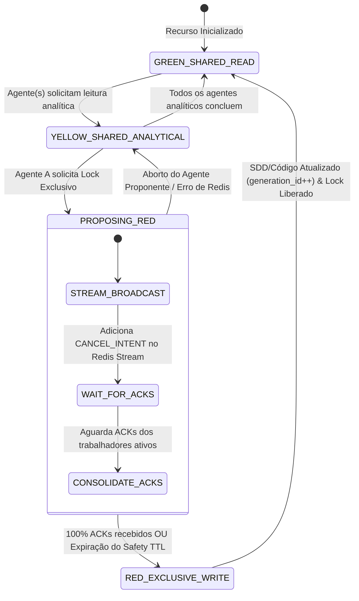
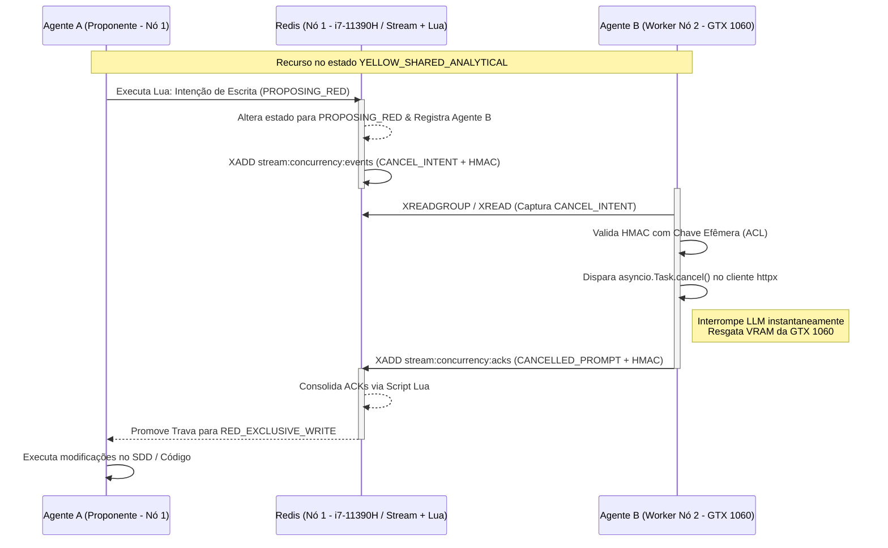

# Specification: Máquina de Estados e Concorrência Distribuída de Agentes (Redis Streams + 3-State Lock + Handshake)

**Status**: ✅ APROVADA — Revisada pós-Brainstorming (v1.1)
**Preset**: software / health-regulated (HIPAA / LGPD compliant)

---

## 1. Contexto e Objetivo (O Quê e Por Quê)

Na arquitetura multi-agente da plataforma Vitalia (orientada a Spec-Driven Development - SDD e esteiras BPMN 2.0), múltiplos agentes especializados analisam e modificam concorrentemente especificações e código. 

A infraestrutura distribuída opera sob restrições severas de hardware:
- **Nó 1 (Orquestrador/Redis)**: Intel i7-11390H | 32GB RAM | GPU MX450 2GB.
- **Nó 2 (Motor de Inferência)**: Intel i7-6700 | GTX 1060 6GB VRAM (limite rígido de 8k tokens e risco iminente de Out-Of-Memory).
- **Conectividade**: Ponte NAT no WSL2 com risco de instabilidade transitória de pacotes.

O objetivo desta especificação é formalizar a **Trava de Concorrência Distribuída de 3 Estados** e o **Protocolo de Handshake com Barreira de Transição**, garantindo:
1. Eliminação total de alucinações por invalidação de contexto (*Prompt Drift*).
2. Interrupção imediata de inferências obsoletas no Nó 2 para preservação de VRAM.
3. Resiliência a oscilações de rede via Redis Streams (`at-least-once delivery`).
4. Conformidade HIPAA/LGPD com assinaturas HMAC e chaves efêmeras isoladas por ACL no Redis.

---

## 2. Requisitos Funcionais e Não-Funcionais

### Requisitos Funcionais (FR-xxx)
- **FR-001**: O sistema **MUST** controlar a trava de concorrência através dos estados `🟢 GREEN_SHARED_READ`, `🟡 YELLOW_SHARED_ANALYTICAL`, `PROPOSING_RED` e `🔴 RED_EXCLUSIVE_WRITE` usando scripts Lua atômicos no Redis.
- **FR-002**: O protocolo de Handshake e barreira de transição **MUST** ser gerenciado via **Redis Streams** (`at-least-once delivery`), garantindo que trabalhadores afetados por instabilidade no WSL2 NAT recebam a notificação de cancelamento.
- **FR-003**: Os trabalhadores no Nó 2 **MUST** utilizar conectores HTTP 100% assíncronos (`httpx.AsyncClient`) consumindo respostas LLM em **modo streaming chunked** (`stream=True`), de forma que o sinal `asyncio.Task.cancel()` interrompa imediatamente a task sem aguardar o payload completo. O poll do Redis Stream **MUST** usar `XREAD BLOCK 50` (máximo 50ms) para garantir a entrega do sinal dentro do critério SC-003 (150ms).
- **FR-004**: O barramento de eventos **MUST** implementar autenticação Zero-Trust usando assinaturas HMAC-SHA256, cujas chaves efêmeras são distribuídas via Redis Keyspace dedicado sob ACLs estritas e TTL de sessão. O script Lua de consolidação de ACKs **MUST** estender o TTL da chave HMAC ativa via `EXPIRE` enquanto uma transação de lock estiver em curso, eliminando a janela de expiração durante handshake.
- **FR-005**: Se um agente não responder ao Handshake dentro do tempo limite (`timeout_ms`), o orquestrador no Nó 1 **MUST** revogar suas credenciais temporárias, marcá-lo como `ZOMBIE_DISCARDED` e liberar o estado `🔴 RED_EXCLUSIVE_WRITE`.
- **FR-006**: O `generation_id` de cada recurso **MUST** ser implementado como **UUID v7** (time-ordered, RFC 9562), eliminando o risco de overflow e colisão ABA de integers. A comparação de `generation_id` nos scripts Lua deve ser feita como comparação de string lexicográfica.
- **FR-007**: A transição para `🔴 RED_EXCLUSIVE_WRITE` **MUST** obrigatoriamente passar pelo estado `🟡 YELLOW_SHARED_ANALYTICAL`, mesmo que nenhum agente analítico esteja ativo. Isso garante que o protocolo de Handshake via Redis Streams seja sempre executado, preservando a integridade do fluxo auditável.
- **FR-008**: Em caso de ACK duplicado (redelivery do `at-least-once`), o orquestrador **MUST** detectar a duplicação via `event_id` já registrado, rejeitar o ACK com resposta de erro estruturada (`DUPLICATE_ACK`) e registrar o evento no log de auditoria com nível `WARN`, incluindo: `event_id`, `agent_id`, `timestamp_original`, `timestamp_duplicate` e delta de tempo entre as duas entregas.

### Critérios de Sucesso (SC-xxx)
- **SC-001a** *(Validação em Hardware Real — gate de release)*: Ocorrência **ZERO** de estouro de memória VRAM (OOM na GTX 1060) decorrente de chamadas LLM mantidas após alteração de especificação. Validado manualmente com Nó 2 físico disponível — não substituível por mock.
- **SC-001b** *(Validação em CI — gate de merge)*: Zero vazamento de `asyncio.Task` não cancelada em 50 ciclos consecutivos `YELLOW→RED→GREEN`, validado por `LT-001` (`tests/concurrency/integration/stress/test_50_red_cycles.py`) com mock de inferência LLM. Executável sem GPU.
- **SC-002**: 100% de entrega e processamento dos sinais de cancelamento mesmo sob desconexões transitórias de até 3 segundos na ponte NAT do WSL2.
- **SC-003**: Tempo de cancelamento local da inferência no worker (do recebimento do evento no Redis Stream até o `asyncio.Task.cancel()` confirmado) **inferior a 150ms**. Este critério é local ao Nó 2 e não inclui o roundtrip do ACK de volta ao orquestrador. **Pré-requisito de implementação**: `XREAD BLOCK` ≤ 50ms e streaming chunked obrigatório (FR-003).

---

## 3. User Stories & Acceptance Scenarios

### User Story 1 - [Atomicidade de Trava de 3 Estados via Lua] (Priority: P1)
Como Orquestrador do Sistema, quero garantir que solicitações de escrita exclusiva sejam estritamente atômicas, para que dois agentes não modifiquem especificações ou códigos simultaneamente.

**Why this priority**: Evita corrupção da Fonte Única da Verdade (SDD) e *race conditions* de escrita (P1).

**Acceptance Scenarios**:
1. **Given** um recurso no estado `🟡 YELLOW_SHARED_ANALYTICAL` com 2 agentes ativos
2. **When** o Agente A envia a solicitação de promoção para trava de escrita
3. **Then** o script Lua altera o estado para `PROPOSING_RED`, bloqueia novas entradas analíticas e registra a intenção do Agente A, rejeitando qualquer outra proposta concorrente no mesmo milissegundo.

---

### User Story 2 - [Handshake via Redis Streams e Salvamento de VRAM] (Priority: P1)
Como Motor de Inferência (Nó 2), quero ser notificado via Redis Streams quando uma escrita for proposta, para cancelar imediatamente a chamada à API do LLM e economizar VRAM.

**Why this priority**: Evita crash por OOM na GTX 1060 e elimina o desperdício de tokens de inferências obsoletas (P1).

**Acceptance Scenarios**:
1. **Given** que o Agente B está executando uma inferência pesada no Nó 2 no estado `🟡 YELLOW`
2. **When** uma mensagem `CANCEL_INTENT` é adicionada ao Redis Stream do recurso
3. **Then** o worker captura o evento, dispara `asyncio.Task.cancel()`, encerra a conexão HTTP em < 150ms e envia o ACK com status `CANCELLED_PROMPT` assinado via HMAC.

---

### User Story 3 - [Tratamento de Desconexão e Agentes Zumbis] (Priority: P2)
Como Orquestrador (Nó 1), quero um mecanismo de TTL e fallback para agentes desconectados, para que a esteira de desenvolvimento não fique travada indefinidamente se um nó perder a rede.

**Why this priority**: Garante resiliência operacional do pipeline mesmo diante de falhas de infraestrutura local (P2).

**Acceptance Scenarios**:
1. **Given** um agente ativo que perdeu a conexão de rede WSL2 durante a fase `PROPOSING_RED`
2. **When** o timer `timeout_ms` da barreira expira sem a recepção do ACK
3. **Then** o Orquestrador marca a resposta como `ZOMBIE_DISCARDED`, encerra a barreira e concede a trava `🔴 RED_EXCLUSIVE_WRITE` ao proponente.

---

## 4. Arquitetura Visual & Diagramas

### 4.1. Diagrama de Transição de Estados (Mermaid)



### 4.2. Diagrama de Sequência de Handshake com Redis Streams



---

## 5. Contratos de Dados (Data Contracts - JSON Schema / Pydantic)

```python
# spec_models/concurrency.py
from pydantic import BaseModel, Field
from typing import Literal, Optional
from datetime import datetime

class LockState(BaseModel):
    resource_id: str = Field(..., description="Identificador único do arquivo SDD ou código fonte")
    current_state: Literal["GREEN", "YELLOW", "PROPOSING_RED", "RED"]
    generation_id: str = Field(..., description="UUID v7 (time-ordered, RFC 9562) para prevenção de problema ABA sem risco de overflow")
    active_analytical_agents: list[str] = Field(default_factory=list, description="Lista de IDs de agentes lendo/analisando atualmente")
    proposing_agent_id: Optional[str] = Field(None, description="ID do agente que solicitou a trava vermelha")

class HandshakeStreamEvent(BaseModel):
    event_id: str = Field(..., description="UUID v7 único da mensagem para idempotência e deduplicação de ACKs")
    resource_id: str
    action: Literal["CANCEL_INTENT", "LOCK_RELEASED"]
    target_agents: list[str] = Field(..., description="Lista de agentes que DEVEM responder com ACK")
    timeout_ms: int = Field(5000, description="TTL limite antes de forçar o avanço da trava (ZOMBIE_DISCARDED). Distinto do SC-003 que mede apenas o cancelamento local no worker.")
    signature: str = Field(..., description="Assinatura HMAC-SHA256 gerada via chave efêmera de sessão")

class AgentAckResponse(BaseModel):
    event_id: str = Field(..., description="UUID v7 do evento original — usado para deduplicação no orquestrador")
    resource_id: str
    agent_id: str
    reaction_code: Literal["SAFE_DISCARD", "CANCELLED_PROMPT", "PARTIAL_STATE_FLUSH", "ZOMBIE_DISCARDED", "DUPLICATE_ACK"]
    timestamp: datetime = Field(default_factory=datetime.utcnow)
    signature: str = Field(..., description="Assinatura HMAC-SHA256 validando a identidade do agente")
```

---

## 6. Requisitos de Testes

### 6.1 Testes Unitários
| ID | Descrição | Critério de Aprovação |
|---|---|---|
| UT-001 | Script Lua de transição de estado: GREEN → YELLOW → PROPOSING_RED → RED | Transição atômica sem race condition sob 10 goroutines/tasks concorrentes |
| UT-002 | Deduplicação de ACK duplicado: mesmo `event_id` enviado 2x | Primeira entrega: `CANCELLED_PROMPT`. Segunda: `DUPLICATE_ACK` + log WARN com delta de tempo |
| UT-003 | Geração e validação de UUID v7 como `generation_id` | UUID gerado é monotonicamente crescente; comparação lexicográfica no Lua retorna correto |
| UT-004 | Extensão de TTL da chave HMAC via Lua durante lock ativo | TTL é renovado a cada iteração; chave não expira durante transação de 4.9s (< 5000ms timeout) |
| UT-005 | Bloqueio de transição GREEN → RED direto | Sistema rejeita a promoção e exige passagem por YELLOW |

### 6.2 Testes de Integração
| ID | Descrição | Critério de Aprovação |
|---|---|---|
| IT-001 | Handshake completo: PROPOSING_RED → 100% ACKs → RED | Ciclo completo < 5000ms com 2 workers ativos |
| IT-002 | Cancelamento local no worker (SC-003) | Tempo entre `XREAD` receber o evento e `asyncio.Task.cancel()` ser chamado < 150ms com `XREAD BLOCK 50` |
| IT-003 | Resiliência WSL2 NAT: desconexão de 3s durante PROPOSING_RED | Worker reconecta, consome evento via `at-least-once`, envia `DUPLICATE_ACK` (não `CANCELLED_PROMPT` novamente) |
| IT-004 | Timeout ZOMBIE_DISCARDED: agente não responde em 5000ms | Orquestrador marca `ZOMBIE_DISCARDED`, libera RED, log de auditoria registra o evento |
| IT-005 | Streaming chunked httpx: cancel interrompe antes do payload completo | Inferência de 2000 tokens cancelada após ≤ 3 chunks processados |

### 6.3 Testes de Carga / Stress
| ID | Descrição | Critério de Aprovação |
|---|---|---|
| LT-001 | 50 ciclos RED consecutivos no mesmo recurso | Zero OOM no Nó 2; SC-001 mantido em 100% dos ciclos |
| LT-002 | 100 UUIDs v7 gerados por segundo | Monotônico em 100% das amostras; zero colisão |

---

## 7. Glossário

| Termo | Definição |
|---|---|
| **Redis Streams** | Estrutura de dados persistente no Redis que permite log de append-only com garantia de entrega *at-least-once*. |
| **Prompt Drift** | Alucinação em IAs causada por mudanças silenciosas no contexto ou especificação durante a geração. |
| **Generation ID** | UUID v7 (time-ordered, RFC 9562) que identifica a versão do recurso no Redis, impedindo sobrescritas obsoletas e eliminando o problema ABA sem risco de overflow. |
| **Chave Efêmera (HMAC)** | Segredo criptográfico gerado temporariamente por sessão e armazenado no Redis com TTL curto sob ACL estrita; TTL estendido automaticamente durante locks ativos. |
| **DUPLICATE_ACK** | Código de reação emitido quando o orquestrador detecta um `event_id` já processado, indicando redelivery do `at-least-once`. |
| **XREAD BLOCK 50** | Instrução Redis que mantém o consumer bloqueado por no máximo 50ms aguardando novos eventos, garantindo latência máxima de poll compatível com SC-003. |
