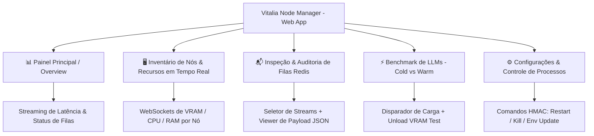
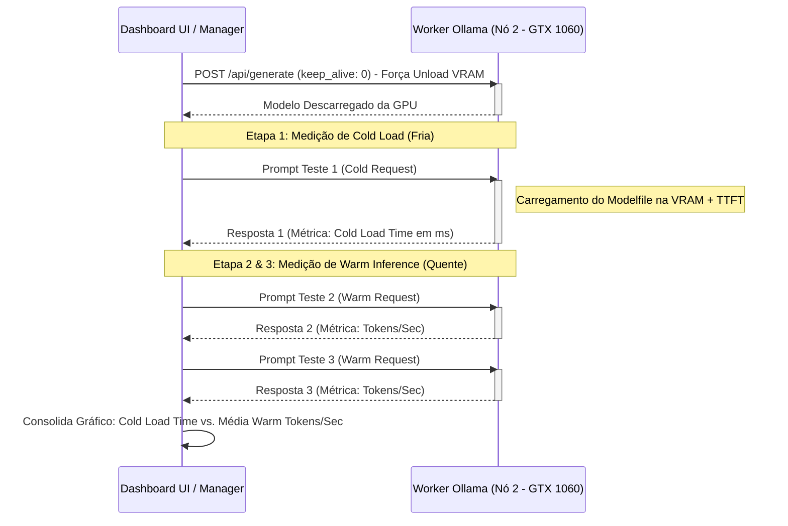

# Specification: Vitalia Node Manager & Telemetry Dashboard (Cross-Node Discovery, Benchmarking & Remote Control)

**Status**: ✅ APROVADA — Revisada pós-Brainstorming (v1.1)
**Preset**: software / health-regulated (HIPAA / LGPD compliant)
**Dependência**: Spec 002 (Redis Concurrency Lock) deve estar em produção antes desta.

---

## 1. Contexto e Objetivo (O Quê e Por Quê)

À medida que o ecossistema de agentes locais da Vitalia se expande para ambientes distribuídos (Notebook + Servidor de Inferência + VPNs / Redes Remotas), torna-se indispensável possuir uma **Interface de Observabilidade e Gerenciamento Unificado (Vitalia Node Manager)**.

O objetivo desta especificação é formalizar a arquitetura da interface de gerenciamento distribuído, cobrindo:
1. **Descoberta Dupla de Nós**: Varredura ativa de sub-rede local e registro ativo via Heartbeat em barramento Redis para conexão a gerenciadores remotos.
2. **Observabilidade & Inspeção de Filas**: Monitoramento visual, navegação e **leitura detalhada dos payloads de mensagens** nas filas Redis (Streams/BullMQ) para auditoria e manutenção.
3. **Tela Dedicada de Inventário e Recursos**: Visualização centralizada do inventário de nós com métricas em tempo real de capacidade total vs. recursos em uso (VRAM, RAM, CPU, disco e containers).
4. **Módulo de Benchmark de LLMs**: Avaliação comparativa de desempenho isolando **Cold Load** (tempo de carga do modelo na VRAM da GPU) contra **Warm Inference** (tokens/segundo em estado quente).
5. **Gerenciamento de Variáveis & Controle Remoto**: Edição segura de variáveis de sistema (`.env`) e controle de ciclo de vida de containers/processos (`start`, `stop`, `kill`, `restart`) operando sob a segurança HMAC da Spec 002.

---

## 2. Requisitos Funcionais e Não-Funcionais

### Requisitos Funcionais (FR-xxx)
- **FR-001**: O sistema **MUST** entregar uma arquitetura híbrida de interface: um **Dashboard Web interativo e responsivo** alimentado por FastAPI + WebSockets/SSE (visão principal), complementado por um **CLI Runner de terminal (`runner.py`)** para observabilidade leve via console.
- **FR-002**: O sistema **MUST** implementar **Descoberta Dupla de Nós**:
  - **Modo Scanner Local**: Varredura ativa de faixa de IP de sub-rede e porta `8001` (API de telemetria).
  - **Modo Heartbeat Remoto**: Registro ativo do nó em `HSET vitalia:nodes:{node_id}` no Redis com **TTL de 5 minutos (300s)**, permitindo que nós locais se conectem e expor seus recursos a gerenciadores em redes remotas/VPNs. Ao reconectar, o nó realiza auto-redescoberta idempotente (re-registro sem intervenção manual). O Dashboard exibe brevemente o estado "Reconectando..." durante a janela de reconexão. *Nota: O TTL de 5min e o mecanismo de reconexão serão revisados em iteração futura para refinar a UX de flicker.*
- **FR-003**: O **Módulo de Benchmark de LLMs** **MUST** seguir o fluxo de medição rigorosa de carga:
  1. **Detectar a versão do Ollama** via `GET /api/version` antes de iniciar o benchmark para determinar o endpoint e parâmetros corretos de descarga de VRAM.
  2. Executar o unload de VRAM usando o método compatível com a versão detectada (ex: `POST /api/generate` com `keep_alive: 0` para versões ≥ 0.1.24; `DELETE /api/models/{model}` para versões que suportem o endpoint de deleção de cache).
  3. Executar no mínimo 3 requisições sequenciais ao modelo.
  4. Medir e diferenciar o **Cold Load Time** (latência da 1ª requisição incluindo carregamento de VRAM + Time-To-First-Token) contra o **Warm Inference Rate** (média de tokens/segundo das requisições 2 e 3).
- **FR-004**: Os comandos de controle de processos (`start`, `stop`, `kill`, `restart`) e atualização de `.env` **MUST** ser publicados via Redis Stream no canal `vitalia:system:commands`, autenticados com assinaturas HMAC-SHA256 utilizando as chaves efêmeras e ACLs da Spec 002.
- **FR-005**: O Painel Principal **MUST** exibir o status sintético das filas do Redis (profundidade de mensagens, workers ativos, lag de consumo), consumo detalhado de VRAM da GPU (vram_used vs vram_total) e latência de rede entre nós em milissegundos.
- **FR-006**: O sistema **MUST** prover uma funcionalidade de **Inspeção de Conteúdo de Filas (Queue Inspector)**, permitindo selecionar qualquer fila ou stream do Redis (`vitalia:system:commands`, `vitalia:rag:sync`, `stream:concurrency:events`), listar mensagens pendentes e consumidas, e visualizar a integridade dos payloads JSON, timestamps e assinaturas para fins de auditoria e depuração. **Acesso completo ao payload (sem mascaramento) é intencional nesta versão para permitir observabilidade total do comportamento do sistema.** Mascaramento de dados e RBAC serão implementados em iteração futura.
- **FR-007**: O sistema **MUST** disponibilizar uma **Tela Dedicada de Inventário de Nós e Recursos**, detalhando a capacidade nominal vs. utilização em tempo real por nó (VRAM alocada, RAM livre/usada, Carga de CPU, status de containers Docker e dados do hardware) transmitidos via WebSockets.
- **FR-008**: A **atualização de métricas em tempo real** dos nós **MUST** ser implementada via **Redis Pub/Sub** (fanout por nó, canal `vitalia:metrics:{node_id}`). Cada nó publica suas métricas no canal dedicado; o backend faz subscribe e encaminha via WebSocket ao Dashboard. O Dashboard **MUST** calcular e exibir o **delay médio de atualização** (em ms) por nó na tela de Inventário, dando visibilidade ao usuário sobre a frescura dos dados. Frequência de publicação recomendada: 1Hz por nó.
- **FR-009**: O acesso ao Dashboard Web **MUST** ser protegido por uma **API Key longa** (mínimo 64 caracteres, gerada aleatoriamente) armazenada em `.env` como `VITALIA_DASHBOARD_API_KEY`. O usuário deve informar esta chave ao abrir a página. Após **15 minutos de inatividade** (sem interação com a página), a sessão expira e a chave deve ser redigitada. Não é necessário fluxo de login/logout; o mecanismo é um modal de autenticação simples na abertura e no timeout.

### Critérios de Sucesso (SC-xxx)
- **SC-001**: Tempo total de varredura e descoberta de nós na sub-rede local inferior a 3 segundos.
- **SC-002**: Precisão absoluta na medição e distinção entre tempo de alocação de GPU (Cold Load) e taxa pura de tokens/segundo (Warm Inference).
- **SC-003**: Execução de comandos de controle remoto (kill/restart) com feedback visual de confirmação na UI em menos de 500ms.
- **SC-004**: Carregamento e renderização do conteúdo JSON de qualquer mensagem de fila em menos de 200ms na tela de Inspeção de Filas.
- **SC-005**: Atualização fluida em tempo real (frequência de 1Hz via Redis Pub/Sub) do Inventário de Recursos dos nós sem congelamento da interface Web. O delay de atualização exibido na UI não deve ultrapassar 500ms em condições normais de rede local.
- **SC-006**: Sessão do Dashboard expirada após exatamente 15 minutos de inatividade; modal de reautenticação exibido em menos de 100ms após o timeout.

---

## 3. User Stories & Acceptance Scenarios

### User Story 1 - [Painel Principal e Observabilidade Sintética] (Priority: P1)
Como Engenheiro do Sistema, quero visualizar a saúde dos nós, o resumo das filas do Redis e a latência de rede em uma tela principal, para identificar gargalos rapidamente.

**Why this priority**: Permite monitoramento centralizado de infraestrutura híbrida (P1).

**Acceptance Scenarios**:
1. **Given** 2 nós (Notebook + Servidor) conectados ao sistema
2. **When** o operador abre a tela principal do Web Dashboard
3. **Then** o sistema exibe gráficos em tempo real com o uso de VRAM da GTX 1060, o número de mensagens pendentes nas filas Redis e a latência *Round-Trip*.

---

### User Story 2 - [Descoberta Dupla de Nós - Local & Remota] (Priority: P1)
Como Administrador de Rede, quero que o dashboard encontre nós locais por varredura e aceite nós remotos por registro de Heartbeat, para gerenciar recursos distribuídos.

**Why this priority**: Permite expansão dinâmica da malha computacional sem reconfiguração manual pesada (P1).

**Acceptance Scenarios**:
1. **Given** um novo nó adicionado à sub-rede local
2. **When** o botão "Scan Local Network" é acionado
3. **Then** o sistema detecta a API de telemetria na porta 8001 e adiciona o nó ao inventário ativo.
4. **Given** um nó remoto conectado via VPN
5. **When** o nó remoto dispara seu Heartbeat para a instância Redis principal
6. **Then** o manager identifica a chave `vitalia:nodes:{node_id}` e registra o nó remoto no dashboard automaticamente.

---

### User Story 3 - [Benchmark de LLM: Cold Load vs. Warm Inference] (Priority: P1)
Como Especialista em IA, quero rodar benchmarks nos modelos dos nós isolando o tempo de carregamento da VRAM da inferência aquecida, para otimizar o roteamento de tarefas.

**Why this priority**: Fundamental para diagnosticar se a latência observada é fruto de alocação de memória na GPU ou capacidade pura do modelo (P1).

**Acceptance Scenarios**:
1. **Given** um modelo selecionado (ex: `qwen2.5-coder-vitalia`) no Nó 2
2. **When** a suíte de benchmark é iniciada pelo Dashboard
3. **Then** o sistema força o unload do modelo (`keep_alive: 0`), dispara a 1ª requisição para registrar o **Cold Load Time**, e em seguida dispara as requisições 2 e 3 para calcular o **Warm Tokens/Sec**, apresentando a comparação gráfica final.

---

### User Story 4 - [Controle Remoto de Processos & Edição de Env] (Priority: P2)
Como Operador, quero enviar comandos de restart/kill de containers e ajustar variáveis de ambiente remotamente com segurança, sem abrir SSH na máquina de destino.

**Why this priority**: Facilita a manutenção do sistema sem expor credenciais brutas de infraestrutura (P2).

**Acceptance Scenarios**:
1. **Given** um container de serviço travado em um nó remoto
2. **When** o operador clica no botão `Restart` no Dashboard Web
3. **Then** o comando assinado com HMAC-SHA256 é publicado no Redis Stream, o trabalhador local executa `docker restart <container>` e o novo status é refletido no dashboard em < 500ms.

---

### User Story 5 - [Inspeção e Auditoria de Conteúdo de Filas] (Priority: P1)
Como Desenvolvedor/Auditor, quero selecionar qualquer fila ou stream do Redis para visualizar as mensagens armazenadas e seus payloads completos, a fim de realizar manutenção e diagnóstico de falhas.

**Why this priority**: Imprescindível para depurar mensagens de barramento, validar assinaturas HMAC e rastrear tarefas travadas nas esteiras (P1).

**Acceptance Scenarios**:
1. **Given** que o operador está na tela de "Queue Inspector"
2. **When** ele seleciona a fila `vitalia:system:commands` ou `stream:concurrency:events`
3. **Then** a interface lista as mensagens com ID, timestamp e dados do remetente, e ao clicar em uma mensagem, exibe o payload JSON formatado com validação do hash HMAC.

---

### User Story 6 - [Tela de Inventário Detalhado e Recursos em Tempo Real] (Priority: P1)
Como Gerente de Infraestrutura, quero uma tela exclusiva dedicada ao inventário de nós com a utilização em tempo real de CPU, RAM, VRAM e containers, para alocação inteligente de carga.

**Why this priority**: Permite tomar decisões de alocação de carga observando capacidade nominal vs. uso instantâneo de hardware em cada nó (P1).

**Acceptance Scenarios**:
1. **Given** que o operador abre a aba "Node Inventory & Resources"
2. **When** os nós estão operando sob carga
3. **Then** a tela exibe um grid detalhado por nó contendo: modelo de GPU, VRAM usada/total (em MB e %), RAM usada/livre, carga de CPU (1m, 5m, 15m), lista de containers Docker ativos e status da conexão.

---

## 4. Arquitetura Visual & Diagramas

### 4.1. Diagrama de Navegação da Interface Web (Mermaid)



### 4.2. Diagrama de Sequência: Benchmark de LLM (Cold Load vs. Warm Inference)



---

## 5. Contratos de Dados (Data Contracts - JSON Schema / Pydantic)

```python
# spec_models/dashboard.py
from pydantic import BaseModel, Field
from typing import Literal, Optional, Dict, Any, List
from datetime import datetime

class NodeResourcesRealtime(BaseModel):
    gpu_status: str = Field(..., description="active | unavailable")
    vram_used_mb: int
    vram_total_mb: int
    vram_percent: float
    gpu_utilization_percent: int
    ram_total_mb: int
    ram_used_mb: int
    ram_free_mb: int
    cpu_load_1m: float
    cpu_load_5m: float
    cpu_load_15m: float
    active_containers: List[Dict[str, str]] = Field(default_factory=list, description="[{name, status}]")

class DetailedNodeInventory(BaseModel):
    node_id: str = Field(..., description="ID único do nó (ex: node-01-server)")
    node_name: str
    ip_address: str
    connection_type: Literal["LOCAL_SUBNET", "REMOTE_REDIS_HEARTBEAT"]
    hardware_profile: str = Field(..., description="ex: i7-6700 | GTX 1060 6GB")
    installed_models: List[str] = Field(default_factory=list)
    realtime_resources: NodeResourcesRealtime
    last_heartbeat: datetime = Field(default_factory=datetime.utcnow)

class QueueMessagePayload(BaseModel):
    stream_key: str = Field(..., description="Nome da fila/stream no Redis (ex: vitalia:system:commands)")
    message_id: str = Field(..., description="ID sequencial da mensagem no Redis Stream")
    sender_node_id: str
    payload_json: Dict[str, Any]
    hmac_signature: str
    is_signature_valid: bool
    timestamp: datetime = Field(default_factory=datetime.utcnow)

class LLMBenchmarkResult(BaseModel):
    benchmark_id: str
    node_id: str
    model_name: str
    cold_load_time_ms: float = Field(..., description="Tempo em ms para carregar o modelo na VRAM e emitir o primeiro token")
    warm_tokens_per_second: float = Field(..., description="Taxa média de geração de tokens em estado aquecido")
    warm_latencies_ms: List[float] = Field(default_factory=list)
    prompt_tokens: int
    completion_tokens: int
    timestamp: datetime = Field(default_factory=datetime.utcnow)

class SystemControlCommand(BaseModel):
    command_id: str = Field(..., description="UUID para idempotência")
    target_node_id: str
    action: Literal["START_CONTAINER", "STOP_CONTAINER", "RESTART_CONTAINER", "KILL_PROCESS", "UPDATE_ENV"]
    target_service: str = Field(..., description="Nome do container ou serviço")
    payload: Dict[str, Any] = Field(default_factory=dict, description="Dados adicionais (ex: chave/valor para UPDATE_ENV)")
    signature: str = Field(..., description="Assinatura HMAC-SHA256 para zero-trust (Spec 002)")
    timestamp: datetime = Field(default_factory=datetime.utcnow)
```

---

## 6. Requisitos de Testes

### 6.1 Testes Unitários
| ID | Descrição | Critério de Aprovação |
|---|---|---|
| UT-001 | Autenticação por API Key: chave correta libera acesso | HTTP 200 com header `X-API-Key` válido |
| UT-002 | Autenticação por API Key: chave inválida bloqueada | HTTP 401 retornado; modal reexibido no frontend |
| UT-003 | Timeout de sessão de 15 minutos | Após 15min sem interação, frontend invalida sessão e exibe modal em < 100ms |
| UT-004 | Detecção de versão do Ollama | `GET /api/version` retorna versão; sistema seleciona endpoint de unload correto |
| UT-005 | Unload VRAM: Ollama >= 0.1.24 usa `keep_alive: 0` | Confirmação de VRAM liberada antes da 1ª requisição de benchmark |
| UT-006 | Cálculo do delay de atualização via Pub/Sub | Delta entre `publish_timestamp` e `receive_timestamp` exibido com precisão de 1ms |

### 6.2 Testes de Integração
| ID | Descrição | Critério de Aprovação |
|---|---|---|
| IT-001 | Scanner local: descoberta de nó em sub-rede | Nó detectado em < 3s após apertar "Scan Local Network" (SC-001) |
| IT-002 | Heartbeat remoto: nó registrado via Redis (TTL 5min) | Nó aparece no dashboard em < 5s após o primeiro HSET |
| IT-003 | Auto-redescoberta: nó reconecta após 30s de perda de rede | Dashboard exibe "Reconectando..." durante a janela; nó re-aparece sem intervenção manual |
| IT-004 | Benchmark completo: Cold Load vs Warm Inference | Diferença de Cold Load > Warm latência (Cold deve ser no mínimo 2x maior que Warm em GTX 1060); gráfico renderizado |
| IT-005 | Queue Inspector: seleção de fila e renderização de payload | JSON do payload renderizado em < 200ms (SC-004); hash HMAC exibido |
| IT-006 | Comando remoto via Redis Stream: Restart de container | Comando publicado + ACK recebido + status atualizado na UI em < 500ms (SC-003) |
| IT-007 | WebSocket de Inventário: atualização de VRAM em tempo real | Métrica atualizada via Pub/Sub a 1Hz; delay exibido na UI ≤ 500ms |
| IT-008 | Dependência Spec 002: HMAC válido obrigatório para comandos | Comando sem assinatura HMAC rejeitado com erro 401 no stream consumer |

### 6.3 Testes End-to-End
| ID | Descrição | Critério de Aprovação |
|---|---|---|
| E2E-001 | Fluxo completo: Login → Ver nós → Rodar benchmark → Inspecionar fila → Restart container | Todos os passos completos sem erro; métricas consistentes entre tabs |
| E2E-002 | Expiração de sessão durante uso ativo | Modal aparece após 15min; após reautenticação, estado da página é preservado |
| E2E-003 | Queda do Redis durante operação | Frontend exibe alerta de conexão perdida; dashboard não trava; reconecta automaticamente |

### 6.4 Testes de Carga
| ID | Descrição | Critério de Aprovação |
|---|---|---|
| LT-001 | 5 nós publicando métricas simultaneamente via Pub/Sub a 1Hz | CPU do orquestrador < 30%; delay médio exibido < 100ms |
| LT-002 | Queue Inspector: fila com 1000 mensagens | Paginação funcional; renderização da página < 200ms |

---

## 7. Glossário

| Termo | Definição |
|---|---|
| **Queue Inspector** | Módulo de inspeção da interface que permite ler e auditar o conteúdo cru e estruturado das mensagens armazenadas nas filas do Redis. Acesso total ao payload é intencional nesta versão para observabilidade máxima. |
| **Cold Load Time** | Latência total para alocar os pesos do modelo na VRAM da GPU e responder ao primeiro token a partir do estado descarregado. |
| **Warm Inference** | Velocidade de geração de texto (tokens por segundo) quando o modelo já reside integralmente na VRAM da GPU. |
| **Redis Heartbeat** | Registro periódico de presença e recursos mantido por cada nó no Redis com TTL de 5 minutos e redescoberta automática após reconexão. |
| **Ponte NAT WSL2** | Configuração de rede virtual que conecta o ambiente Linux WSL2 ao sistema hospedeiro Windows e à sub-rede física. |
| **Redis Pub/Sub Fanout** | Modelo de distribuição de métricas onde cada nó publica em canal dedicado (`vitalia:metrics:{node_id}`) e o backend faz subscribe, encaminhando ao WebSocket do Dashboard. |
| **VITALIA_DASHBOARD_API_KEY** | Chave de autenticação de acesso ao Dashboard, armazenada em `.env`, mínimo 64 caracteres alfanuméricos aleatórios. |
